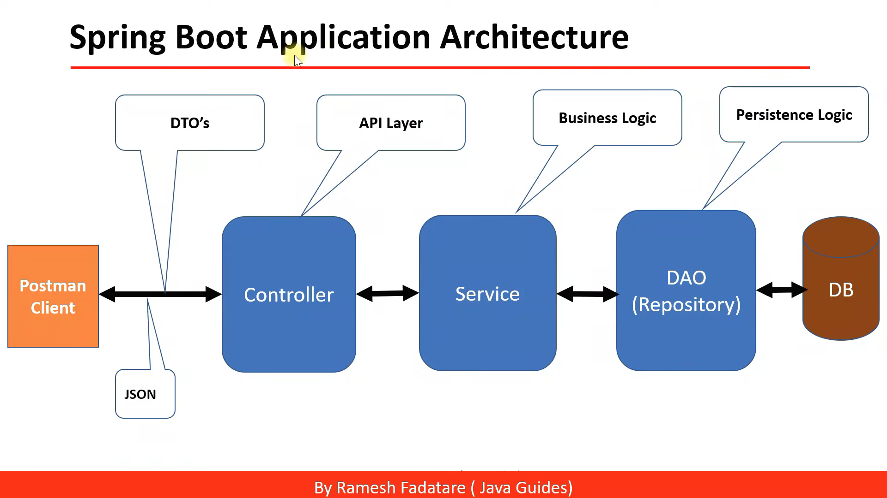

# Workflow cơ bản

## Mô hình 3 lớp 

Mô hình được dử dụng ở back end là MVC và mô hình 3 lớp

Mô hình 3 lớp có thể hiểu như sau

## Tóm tắt workflow 

Có 2 cách chính: Bottom up và top down

### Bottom up
1. Tạo repository interface trong app/Repositories/Contracts/
2. Tạo lớp repository kế thừa repository interface trong app/Repositories/Eloquent/, lớp repository này có thể được [inject](https://viblo.asia/p/dependency-injection-trong-php-1Je5EMYj5nL) bởi nhiều lớp model khác trong app/Models nếu cần thiết
3. Bind repository interface và lớp repository với nhau trong app/Providers/AppServiceProvider.php
4. Tạo lớp service trong app/Services/, lớp service này có thể được [inject](https://viblo.asia/p/dependency-injection-trong-php-1Je5EMYj5nL) bởi nhiều lớp repositoy khác nếu cần thiết
5. Tạo lớp controller trong app/Http/Controllers, lớp controller này có thể được [inject](https://viblo.asia/p/dependency-injection-trong-php-1Je5EMYj5nL) bởi nhiều lớp service khác nếu cần thiết
6. Tạo các route cần thiết trong routes/api.php, mỗi route có thể gọi nhiều controller nhưng phương thức http phải khác nhau. Ví dụ: GET /api/product sẽ gọi controller getProductList, POST /api/product sẽ gọi controller createProduct
7. Test api bằng postman

### Top down 
Làm theo các bước ở phương pháp Bottom up theo trình tự: 6 -> 5 -> 4 -> 1 -> 2 -> 3 -> 7

### Cách khác

Các bước ở phương pháp Bottom up thực ra làm theo thứ tự nào cũng được, 2 cách trên nó có trình tự hơn thôi

Mọi người thoải mái làm theo cách khác nha